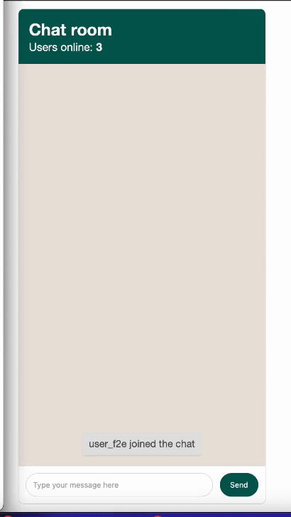

# Demo-Chat: A Real-Time HTMX and Bun Chat Application

## Overview

Demo-Chat is a web-based chatroom application using Bun and HTMX, featuring real-time messaging and dynamic user notifications

## Project Showcase

## Key Features

- **Real-Time Bun Websockets**: Ensures instant messaging and updates.
- **Interactive HTMX Chat Interface**: Easy-to-use chat interface powered by HTMX.
- **User Notifications**: Alerts when users join or leave, enhancing the chat experience.
- **Online User Count**: Shows how many users are currently in the chat.
- **Automatic Username Assignment**: Simplifies the user experience by auto-generating usernames.
- **Secure Message Handling**: Implements message sanitization for user safety.
- **Timestamped Messages**: Each message is clearly marked with its sending time.

## Setup

### Prerequisites

- **Bun**: A must-have for running this Bun chat server.

### Installation

1. **Clone the Repository**: `git clone [repository-url]`.
2. **Enter the Project Directory**: `cd demo-chat`.
3. **Install Dependencies**: `bun install` to get started.

### Launching the Chat

1. **Activate the Server**: Use `bun run dev` to start.
2. **Join the Chat**: Simply open `localhost:4000/chatroom` in your browser.

## Usage

Perfect for those seeking a straightforward, real-time chat experience using HTMX and Bun.

## License

Under the MIT License for open use and adaptation.
